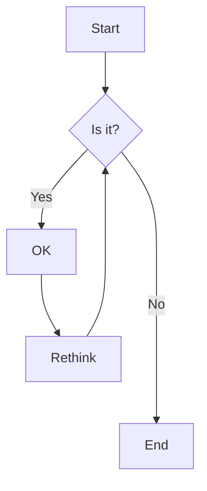
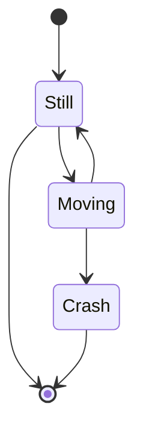
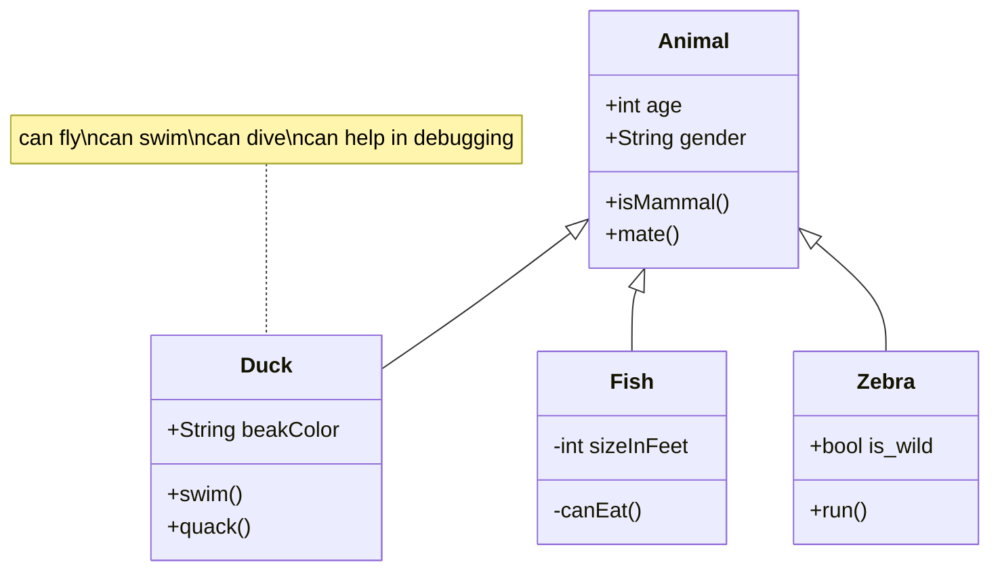

# Different types of diagrams

## Description

Different types of diagrams can be created, among them are flow diagrams, graphs, class diagrams, state diagrams, and so on.

## For example

### Flow Diagram

###  States Diagram

### Class Diagram

